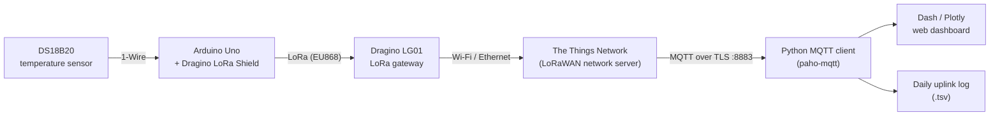

# LoRaWAN Cold Chain Temperature Monitoring

> Embedded Systems & IoT internship project at **Tinest**, Kasserine, Tunisia (Jul–Sep 2023)

An end-to-end IoT system for **cold chain traceability**. Battery-friendly LoRaWAN sensor nodes measure the temperature of food during storage and transport. The readings travel through **The Things Network (TTN)** and are exported over **MQTT** to a **real-time web dashboard**, which raises an alert whenever the temperature leaves its safe range.

## System architecture



| Layer | Technology | Role |
|---|---|---|
| Sensing | DS18B20 (1-Wire, ±0.5 °C) | Digital temperature measurement |
| End node | Arduino Uno + Dragino LoRa Shield (SX1276), IBM LMIC | Reads the sensor and sends LoRaWAN uplinks |
| Gateway | Dragino LG01 | Forwards LoRa packets to the network server over IP |
| Network | The Things Network (LoRaWAN v1.0.x, ABP) | Handles device authentication, deduplication and decryption |
| Integration | MQTT (TLS), paho-mqtt | Exports uplinks to the application and sends downlinks |
| Application | Python, Dash, Plotly, Bootstrap | Live visualisation, threshold alerts, login-protected access |

## Technical details

### Firmware (`firmware/lorawan_temperature_node`)
- Built on the **IBM LMIC** LoRaWAN stack with **ABP** activation (NwkSKey, AppSKey, DevAddr).
- Sends an uplink every **60 s**. Scheduling is fully event-driven through LMIC jobs (`os_setTimedCallback` on `EV_TXCOMPLETE`), so there is no blocking delay.
- **Payload:** the temperature goes out as a 4-byte IEEE-754 float (little-endian) on **FPort 1**, which keeps airtime low.
- **Radio settings:** SF7 at 14 dBm for uplinks, and SF9 for the RX2 window, as TTN EU868 requires.
- **Pin mapping** for the Dragino shield: NSS = D10, RST = D9, DIO0/1/2 = D2/D6/D7. The DS18B20 is on D8.

### MQTT integration (`mqtt/`)
- `ttn_uplink_logger.py` connects to the TTN v3 MQTT broker over **TLS (port 8883)** and subscribes to `v3/<app-id>@ttn/devices/+/up`. It writes every uplink with its radio metadata (RSSI, SNR, data rate, frame counter, airtime) to a daily tab-separated log.
- `ttn_downlink_publisher.py` publishes base64-encoded downlinks to `v3/<app-id>@ttn/devices/<device-id>/down/push`, which can control actuators or configure the node.
- Credentials are read from **environment variables**, never hard-coded.

### Dashboard (`dashboard/app.py`)
- A multi-page **Dash** app (Home and About) with a Bootstrap dark theme.
- **Live mode:** a background paho-mqtt client decodes each uplink's `frm_payload` (or TTN's `decoded_payload`) and adds the reading to a thread-safe buffer. The graph refreshes every 5 s.
- **Demo mode:** when no TTN credentials are set, the app plots simulated data, so you can try the UI without any hardware.
- **Alerts:** a safe band is drawn on the graph (0–8 °C by default, configurable), and the status banner turns red when a reading is out of range.
- **Access control:** optional HTTP Basic Auth through `dash-auth`.

## Repository structure

```
├── firmware/
│   └── lorawan_temperature_node/
│       └── lorawan_temperature_node.ino   # Arduino + LMIC LoRaWAN node
├── mqtt/
│   ├── ttn_uplink_logger.py               # TTN MQTT subscriber → daily log file
│   └── ttn_downlink_publisher.py          # TTN MQTT downlink sender
├── dashboard/
│   └── app.py                             # Dash / Plotly monitoring dashboard
└── requirements.txt
```

## Getting started

### 1. Node firmware
1. Install the Arduino libraries **MCCI LoRaWAN LMIC** (or IBM LMIC), **OneWire** and **DallasTemperature**.
2. Register an **ABP** device in the TTN console, then paste its `NWKSKEY`, `APPSKEY` and `DEVADDR` into the sketch.
3. Wire the DS18B20 data line to **D8**, with a 4.7 kΩ pull-up to 5 V.
4. Upload the sketch to the Arduino Uno fitted with the Dragino LoRa Shield.

### 2. Backend and dashboard
```bash
pip install -r requirements.txt

# TTN MQTT credentials (Console → Applications → Integrations → MQTT)
export TTN_USER="my-app@ttn"
export TTN_API_KEY="NNSXS.xxxxx"
export TTN_REGION="eu1.cloud.thethings.network"

# Optional
export DASH_USERS="admin:changeme"      # dashboard login
export TEMP_MIN=0 TEMP_MAX=8            # safe range in °C

python dashboard/app.py                 # http://127.0.0.1:8050
python mqtt/ttn_uplink_logger.py        # log every uplink to YYYYMMDD.txt
```
If you run the dashboard without the TTN variables, it starts in **demo mode**.

## Skills demonstrated

`LoRa / LoRaWAN` · `The Things Network` · `MQTT` · `Embedded C/C++ (Arduino)` · `IBM LMIC` · `1-Wire sensors` · `Python` · `Dash / Plotly` · `IoT system architecture`

## Author

**Abdelbaki Ghodhbani**, Embedded Software Engineer: [LinkedIn](https://www.linkedin.com/in/abdelbaki-ghodhbani) · [GitHub](https://github.com/abdelbaki-ghodhbani)
